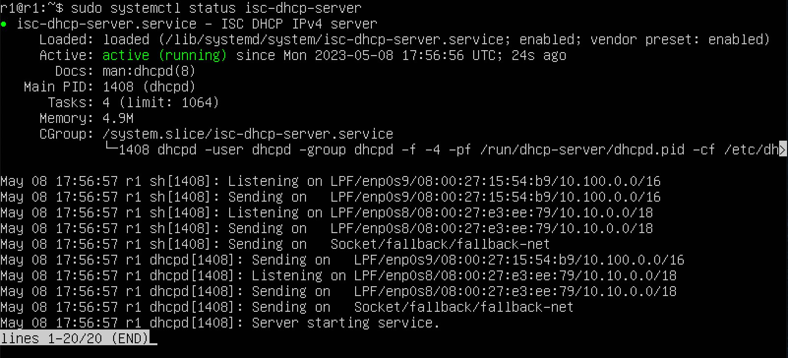

## Part 1. Инструмент ipcalc

### 1.1 Сети и маски
**1) адрес сети `192.167.38.54/13 `**

Команда - `ipcalc 192.167.38.54/13 `

192.267.38.54

**2) перевод маски `255.255.255.0` в префиксную и двоичную запись, `/15` в обычную и двоичную, `11111111.11111111.11111111.11110000` в обычную и префиксную**
Команда - `ipcalc 255.255.255.0`

префиксная форма записи */24
двоичная форма записи *11111111.11111111.11111111.00000000
Команда - `ipcalc /15`

Обычная запись - `255.254.0.0`. Двоичная запись - `11111111.11111110.00000000.00000000`

Посчитаем количество ненулевых бит в 11111111.11111111.11111111.11110000 и получим - 28.
Команда - `ipcalc 192.167.38.54/28`

Обычная запись - `255.255.255.240`. Префиксная запись - `/28`.

**3) минимальный и максимальный хост в сети `12.167.38.4` при масках: `/8, 11111111.11111111.00000000.00000000, 255.255.254.0 и /4`**

Воспользуемся командами:
`ipcalc 12.167.38.4/8`
`ipcalc 12.167.38.4/4`
`ipcalc 12.167.38.4/16`
`ipcalc 12.167.38.4/23`

Минимальный хост - `12.0.0.1`. Максимальный хост - `12.255.255.254`.

Минимальный хост - `0.0.0.1`. Максимальный хост - `15.255.255.254`.

Минимальный хост - `12.167.0.1`. Максимальный хост - `12.167.255.254`. 

Минимальный хост - `12.167.38.1`. Максимальный хост - `12.167.39.254`.

### 1.2. Localhost  
**Определить и записать в отчёт, можно ли обратиться к приложению, работающему на localhost, со следующими IP: 194.34.23.100, 127.0.0.2, 127.1.0.1, 128.0.0.1**

Пишем в гугле "localhost" и в первой ссылке на википедию видим, что для localhost зарезервирован диапазон ip адресов от 127.0.0.1 до 127.255.255.254 включительно. Из этого можем сделать вывод, что мы сможем обратиться к приложениям, работающим со следующими ip: `127.0.0.2`, `127.1.0.1`.  

Воспользуемся командами:
`ipcalc 194.34.23.100`
`ipcalc 127.0.0.2`
`ipcalc 127.1.0.1`
`ipcalc 128.0.0.1`

Интерфейс loopback отсутствует в строке "Hosts/Net", следовательно данный адрес нам не подходит.
Loopback присутствует, следовательно адрес нам подходит.
Loopback тоже есть, следовательно адрес нам подходит.
Loopback нет, адрес не подходит. 

### 1.3. Диапазоны и сегменты сетей  

**1) Какие из перечисленных IP можно использовать в качестве публичного, а какие только в качестве частных: 10.0.0.45, 134.43.0.2, 192.168.4.2, 172.20.250.4, 172.0.2.1, 192.172.0.1, 172.68.0.2, 172.16.255.255, 10.10.10.10, 192.169.168.1**

Выведем информацию обо всех ip адресах с помощью команды `ipcalc <ip адрес>`

Нас интересует строка "Hosts/Net" и конкретно надпись "Private Internet", наличие которой говорит о том, что ip адрес принадлежит частной сети. 

>Адреса `10.0.0.45`, `192.168.4.2`, `172.20.250.4`, `172.16.255.255`, `10.10.10.10` можно использовать только в качестве частных.  

>Адреса `134.43.0.2`, `172.0.2.1`, `192.172.0.1`, `172.68.0.2`, `192.169.168.1` можно использовать в качестве публичных.

## Part 2. Статическая маршрутизация между двумя машинами

### 2.0 Поднятие двух виртуальных машин и просмотр интерфейсов

**1) Поднять две виртуальные машины**

**2) С помощью команды ip a посмотреть существующие сетевые интерфейсы**

**3) Описать сетевой интерфейс, соответствующий внутренней сети, на обеих машинах и задать следующие адреса и маски: ws1 - 192.168.100.10, маска /16, ws2 - 172.24.116.8, маска /12**

### 2.1 Добавление статического маршрута вручную

Добавить статический маршрут от одной машины до другой и обратно при помощи команды вида ip r add
Пропинговать соединение между машинами

### 2.2. Добавление статического маршрута с сохранением

**1) Перезапустить машины**

**2) Добавить статический маршрут от одной машины до другой с помощью файла etc/netplan/00-installer-config.yaml**

**3) Пропинговать соединение между машинами**

## Part 3. Утилита iperf3

**3.1. Скорость соединения**

Перевести и записать в отчёт: 8 Mbps в MB/s, 100 MB/s в Kbps, 1 Gbps в Mbps  
1) 8 Mbps = 1 MB/s
2) 100 MB/s = 819200 Kbps 
3) 1 Gbps = 1024 Mbps

**3.2. Утилита iperf3**
**Измерить скорость соединения между ws1 и ws2**

ws2 выступает в роли сервера. Запуск командой `iperf3 -s`
ws1 выступает в роли клиента. Запуск командой `iperf3 -c 172.24.116.8`

## Part 4. Сетевой экран

**4.1. Утилита iptables**

>Ключи iptables:
>-A: добавить правило в конец цепочки
>-C: проверить существование правила в цепочке
>-D: удалить правило из цепочки
>-E: изменить имя пользовательской цепочки
>-F: очистить цепочку от всех правил
>-I: вставить правило в начало цепочки
>-L: вывести список правил в цепочке
>-N: создать новую пользовательскую цепочку
>-X: удалить пользовательскую цепочку
>-Z: сбросить счетчики пакетов и байтов для всех правил в цепочке
>-P: установить политику по умолчанию для цепочки
>-p: указать протокол (tcp, udp, icmp и т.д.)
>-s: указать исходный IP-адрес
>-d: указать целевой IP-адрес
>--sport: указать исходный порт
>--dport: указать целевой порт
>-j: указать целевое действие (ACCEPT, DROP, REJECT и т.д.)
>-i: указать сетевой интерфейс входящего трафика
>-o: указать сетевой интерфейс исходящего трафика
>-m: указать модуль расширения (например, mod_tcpudp для фильтрации по портам TCP и UDP)
>-v: выводить детальную информацию о правилах
>-h: вывести справку о команде

Посмотреть состояние iptables:
`sudo iptables -L`

Посмотреть состояние таблицы:
`sudo iptables -t <имя таблицы> -L`

Нужно добавить в файл подряд следующие правила:
1) на ws1 применить стратегию когда в начале пишется запрещающее правило, а в конце пишется разрешающее правило (это касается пунктов 4 и 5)
2) на ws2 применить стратегию когда в начале пишется разрешающее правило, а в конце пишется запрещающее правило (это касается пунктов 4 и 5)
3) открыть на машинах доступ для порта 22 (ssh) и порта 80 (http)
4) запретить echo reply (машина не должна "пинговаться”, т.е. должна быть блокировка на OUTPUT)
5) разрешить echo reply (машина должна "пинговаться")

Запустить файлы на обеих машинах командами `chmod +x /etc/firewall.sh` и `/etc/firewall.sh`

Машина ws1 не сможет отправлять echo-request пакеты, но сможет принимать их, тогда как машина ws2 сможет отправлять эти пакеты, но не сможет принимать их.

В обоих случаях отрабатывается верхнее правило (DROP для ws1 и ACCEPT для ws2).

Если пакет соответствует только верхнему правилу в цепочке, то будет выполнено только это правило. Однако, если пакет соответствует нескольким правилам в цепочке, то будет выполнено только первое правило, которое соответствует пакету.

Если нужно, чтобы пакет, соответствующий более чем одному правилу, был обработан несколькими правилами, можно использовать цепочки пользовательского определения (user-defined chains) в iptables, где каждое правило может перенаправлять пакеты в другие цепочки.

**4.2. Утилита nmap**

Командой `ping` найти машину, которая не "пингуется" 

Видим что с `ws1` в `ws2` не передаются пакеты

утилитой nmap показать, что хост машины запущен

Проверка: `Host is up`

И опять проверка на пинг машины без утери пакетов

Сохраняем дампы образов виртуальных машин
<!--  -->

## Part 5. Статическая маршрутизация сети

Поднять пять виртуальных машин (3 рабочие станции (ws11, ws21, ws22) и 2 роутера (r1, r2)) как на фото

**5.1. Настройка адресов машин**

Настроить конфигурации машин в `etc/netplan/00-installer-config.yaml` согласно сети на рисунке.

Перезапустить сервис сети. Если ошибок нет, то командой `ip -4 a` проверить, что адрес машины задан верно. Также пропинговать `ws22` с `ws21`. Аналогично пропинговать `r1` с `ws11`.

**5.2. Включение переадресации IP-адресов.**

`sysctl -w net.ipv4.ip_forward=1`
При таком подходе переадресация не будет работать после перезагрузки системы.

Откройте файл `/etc/sysctl.conf` и добавьте в него следующую строку:
`net.ipv4.ip_forward = 1`
При использовании этого подхода, IP-переадресация включена на постоянной основе.

**5.3. Установка маршрута по-умолчанию**

Настраиваем маршрут по-умолчанию (шлюз) для рабочих станций. Для этого добавляем ` gateway4: ip роутера ` в файле конфигураций ` etc/netplan/00-installer-config.yaml `

Командой - `sudo vim /etc/netplan/00-installer-config.yaml`

Вносим изменения командой - `sudo netplan apply`

Вызовем `ip r`, чтобы показать, что  маршрут добавился в таблицу маршрутизации

Пропингуем с ` ws11 ` роутер ` r2 `, пинг не пройдёт, т.к. роутер "не знает" куда вернуть ответ, при этом передача пакетов с машины осуществляется. 

Чтобы посмотреть какие девайсы можно прослушать

Командой - `tcpdump -D ` 

Запускаем на ` r2 ` утилиту ` tcpdump `, она позволяет прослушать порты и вывести на экран информацию с каких IP адресов приходят пакеты. В данном случае слушаем интерфейс ` enp0s8 `

Командой - `tcpdump -tn -i enp0s8 `

Сначала на экране r2 будет пусто, идёт ожидание входящих пакетов

Запускаем `ping` на ` ws11 ` 

Командой - `ping -c 5 10.100.0.12`

На экране должно ` r2 ` должно появиться

**5.4. Добавление статических маршрутов**

Добавить в роутеры `r1` и `r2` статические маршруты в файле конфигураций. Пример для `r1` маршрута в сетку `10.20.0.0/26`

Вызвать `ip r` и показать таблицы с маршрутами на обоих роутерах. Пример таблицы на `r1`

Запустить команды на `ws11`

`ip r list 10.10.0.0/18 `

`ip r list 0.0.0.0/0 `

Для адреса `10.10.0.0/18` был выбран маршрут, отличный от `0.0.0.0/0` (он попадает под маршрут по-умолчанию), т.к. машина ` ws11 ` соединена с сетью `10.10.0.0/18` по своему IP-адресу `10.10.0.2`, для других адресов используется маршрут по умолчанию, который указан в файле `10.10.0.1`.

**5.5. Построение списка маршрутизаторов**

Для установки утилиты на ` ws11 ` используем команду 

`sudo apt install traceroute `

Запустим на `r1` команду дампа 

`tcpdump -tnv -i enp0s8`

При помощи утилиты `traceroute` построим список маршрутизаторов на пути от `ws11` до `ws21`. 

**5.6. Использование протокола ICMP при маршрутизации**

Запустим на `r1` перехват сетевого трафика, проходящего через `enp0s8` с помощью команды

`sudo tcpdump -n -i enp0s8 icmp`

Пропингуем ws11 c командой

`ping -c 1 10.30.0.111`

Сохраняем дампы образов виртуальных машин

## 6.1 Настройка службы DHCP на r2

Если утилита `isc-dhcp-server` ещё не установлена, то файла `/etc/dhcp/dhcpd.conf` ещё не существует в нужном виде. Соотвтетственно для работы с протоколом `DHCP` сначала надо установить эту утилиту

`sudo apt-get install isc-dhcp-server`

Теперь для `r2` можем настроить в файле `/etc/dhcp/dhcpd.conf` конфигурацию службы  `DHCP`

указываем адрес маршрутизатора по-умолчанию, DNS-сервер и адрес внутренней сети.

Открываем файл `/etc/dhcp/dhcpd.conf` для редактирования

`sudo vim /etc/dhcp/dhcpd.conf`

Так выглядит только что открытый файл `dhcpd.conf`

Вносим изменения

в файле `/etc/resolv.conf`(содержит адреса серверов имен, к которым имеет доступ данная система) прописываем `nameserver 8.8.8.8`

`sudo vim /etc/resolv.conf`

Перезагрузим службу `DHCP`

`systemctl restart isc-dhcp-server`

Можно проверить статус службы

`sudo systemctl status isc-dhcp-server`

Изменим настройки машин `ws21` и `ws22` в файле конфигурации, чтобы сделать протокол `DHCP` активным. На каждой машине введём

`sudo vim /etc/netplan/00-installer-config.yaml`

`sudo netplan apply`

Перезагружаем виртуальную машину `ws21`

`sudo systemctl reboot`

Проверяем присвоенный устройствам адрес

Проверим соединение машины `ws22` с `ws21`

## 6.2 Указать MAC-адреса 

Чтобы указать MAC-адрес у `ws11`, в файл `etc/netplan/00-installer-config.yaml` надо добавить строки: `macaddress: 10:10:10:10:10:BA`, `dhcp4: true`

`sudo vim /etc/netplan/00-installer-config.yaml`

`sudo netplan apply`

`sudo shutdown -h now`ip

Заходим в менеджер виртуальных машин VirtualBox и там настраиваем `ws11` MAC-адрес

Для `r1` настроим аналогично `r2`, но выдачу адресов сделаем с жесткой привязкой к MAC-адресу (`ws11`).

`sudo apt-get install isc-dhcp-server`

`sudo vim /etc/dhcp/dhcpd.conf`

`sudo vim /etc/resolv.conf`

`systemctl restart isc-dhcp-server`

`sudo systemctl status isc-dhcp-server`

Проводим аналогичные тесты - смотрим какой адрес назначен машине `ws11`

`ip a`

Пропингуем соединение

`ping -c 5 10.10.0.4`

**6.3 Обновление ip адреса с помощью команды `sudo dhclient`.**

Проверяем IP до обновления

Запросим с `ws21` обновление ip адреса с помощью команды

`sudo dhclient -v`

`-v` - будет выведена дополнительная информация.

`ip a`

Выполним команду для удаления старого IP адреса

`sudo dhclient -r`

`-r` - явно освобождает текущую аренду ip адреса.

Чтобы обновить или освободить IP-адрес для конкретного интерфейса, например, eth0, необходимо ввести:

`sudo dhclient -r eth0`

`sudo dhclient eth0`

Проверим IP адреса

`ip a`

В части 6 были использованы следующие опции `DHCP` протокола:
`option routers *ip-address [, ip-address...];*` - адреса шлюзов для клиентской сети. Маршрутизаторы должны быть перечислены в порядке предпочтительности.
`option domain-name-servers *ip-address [, ip-address...];*` - Список DNS серверов  доступных клиенту. Сервера должны быть перечислены в порядке предпочтительности.

Сохраняем дампы образов виртуальных машин

## Part 7. NAT

Для работы с сервером `apache2`, установим его на машины ` r1 `, ` r2 ` и ` ws22 `. Возможно ` apache2 ` не будет устанавливаться, тогда возможно поможет обновление системы (см. ниже).

`sudo apt install apache2`

Обновление системы

`sudo apt update`

`sudo apt upgrade -y`
`-y` - при запросе сразу согласиться с установкой.

## 7.1 Делаем сервер Apache2 общедоступным.

В файле `/etc/apache2/ports.conf` на `ws22` и `r2` меняем строку `Listen 80` на `Listen 0.0.0.0:80`.

`sudo vim /etc/apache2/ports.conf `

Запустить веб-сервер **Apache** командой на ` ws22 ` и ` r1 `

`service apache2 start ` 

## 7.2 Создаем фаервол на r2 (как в части 4) Следующие правила:

1) Удаление правил в таблице filter - ` iptables -F `
2) Удаление правил в таблице "NAT" - ` iptables -F -t nat `
3) Отбрасывать все маршрутизируемые пакеты - ` iptables --policy FORWARD DROP `

Запустим файлы на командой

`sudo chmod +x /etc/firewall.sh`

`sudo bash /etc/firewall.sh `

 При запуске файла ` firewall.sh ` с этими правилами, ` ws22 ` не должна "пинговаться" с ` r1 `.

Проверяем соединение между ` r1 ` и ` ws22 `

` ping -c 5 10.20.0.20 `

Проверяем соединение между ` ws22 ` и ` r1 `

` ping -c 5 10.100.0.11 `

1) Разрешить маршрутизацию всех пакетов протокола ICMP, для этого прописываем правило для протокола *icmp* и цепочки *FORWARD*

`sudo vim /etc/firewall.sh`

Теперь при запуске файла ` firewall.sh ` с этими правилами, ` ws22 ` должна "пинговаться" с ` r1 `

Проверяем соединение между ` r1 ` и ` ws22 `
Проверяем соединение между ` ws22 ` и ` r1 `

`ping -c 5 10.100.0.11`
`ping -c 5 10.20.0.20 `

Добавляем в файл ещё два правила:

1) Включаем `SNAT`, а именно маскирование всех локальных ip из локальной сети, находящейся за `r2` (по обозначениям из Части 5 - сеть 10.20.0.0)

2) Включаем `DNAT` на 8080 порт машины `r2` и добавим к веб-серверу Apache, запущенному на `ws22`, доступ извне сети

` sudo vim /etc/firewall.sh `

> Значения использованных опций:
> - ` t ` - указывает на используемую таблицу;
> - ` p ` - указывает протокол, такие как tcp, udp, udplite и другие, поддерживаемые системой, ознакомиться со списком можно в файле ` /etc/protocols `;
> - ` m ` - подключает указанный модуль;
> - ` s ` - указывает адрес источника пакета, в качестве значения можно указать как один IP-адрес, так и диапазон;
> - ` i ` - задает входящий сетевой интерфейс;
> - ` o ` - указывает исходящий сетевой интерфейс;
> - ` --dport ` - порт получателя пакета;
> - ` DNAT ` — подменяет адрес получателя в заголовке IP-пакета, основное применение — предоставление доступа к сервисам снаружи, находящимся внутри сети;
> - ` SNAT ` — служит для преобразования сетевых адресов, применимо, когда за сервером находятся машины, которым необходимо предоставить доступ в Интернет, при этом от провайдера имеется статический IP-адрес.

#### SNAT и DNAT 

Запускаем файл также, как в Части 4 (перед тестированием отключим сетевой интерфейс `NAT` (его наличие можно проверить командой ` ip a `) в VirtualBox, если он включен)

Проверяем соединение по TCP для SNAT, для этого с ` ws22 ` подключаемся к серверу Apache на ` r1 ` командой ` telnet [адрес] [порт] `

` telnet 10.100.0.11 80 `

Проверить подмену IP-адреса можно с помощью команды ` tcpdump ` - пингуем с машины ` ws22 ` роутер ` r1 `, в выводе ` tcpdump ` будет отображаться с какого адреса идет запрос - IP-адрес ` r2 ` 

Проверяем соединение по TCP для DNAT, для этого с ` r1 ` подключаемся к серверу Apache на ` ws22 ` (обращаться по адресу ` r2 ` и порту 8080)

` telnet 10.100.0.12 8080 `

При этой проверке следует отключить на ` ws22 ` автоматическую выдачу ip ` enp0s3 `

` sudo tcpdump -i enp0s8 `

Сохраняем дампы образов виртуальных машин